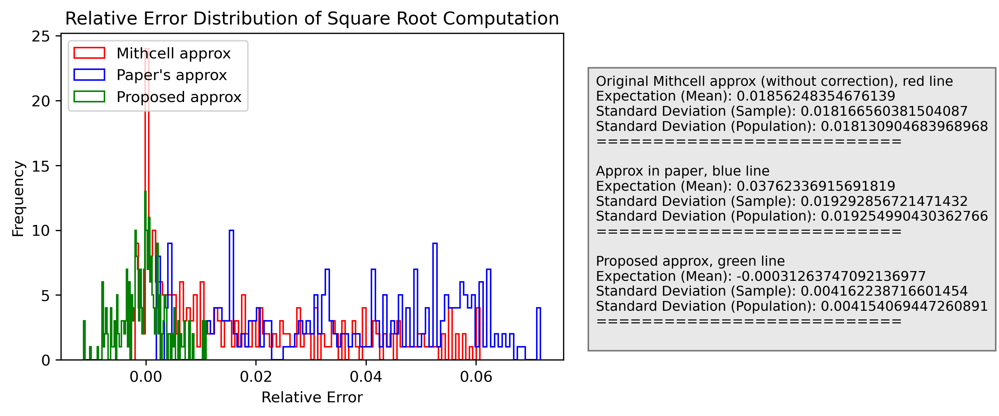
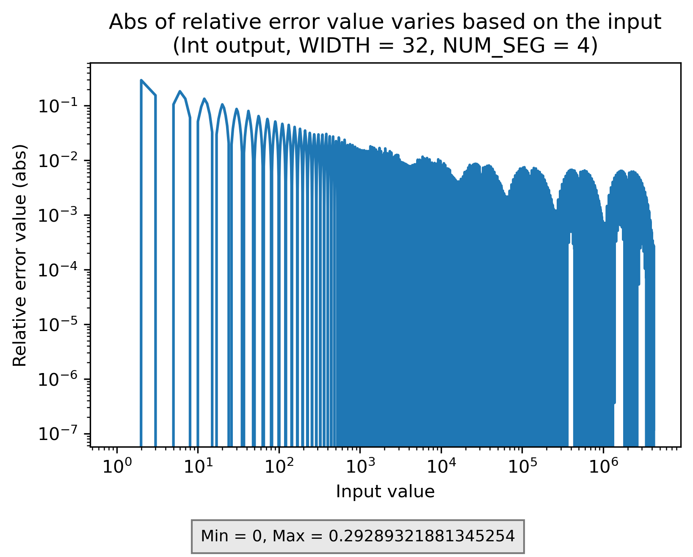
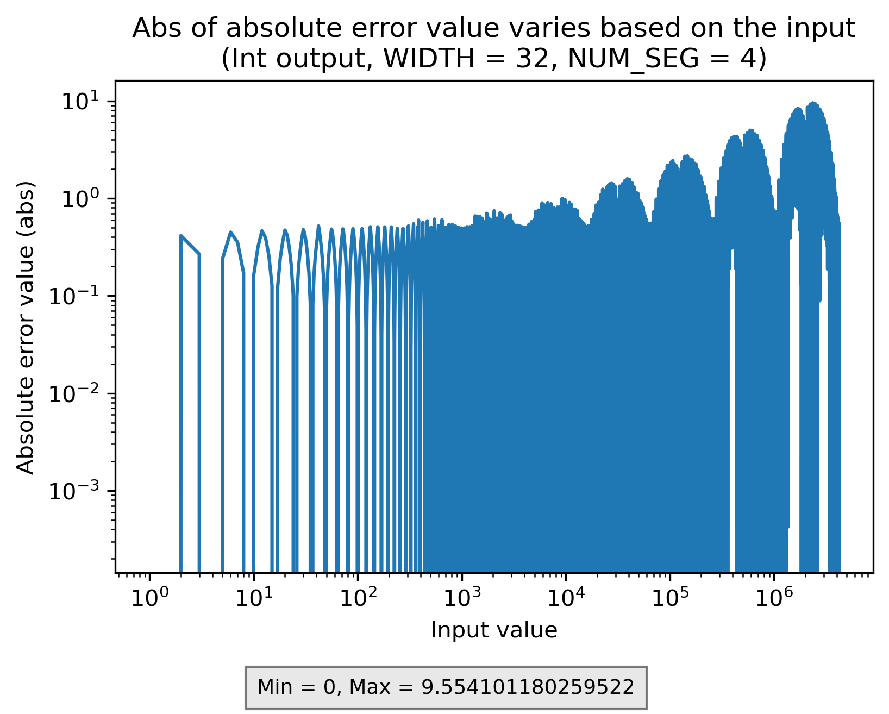
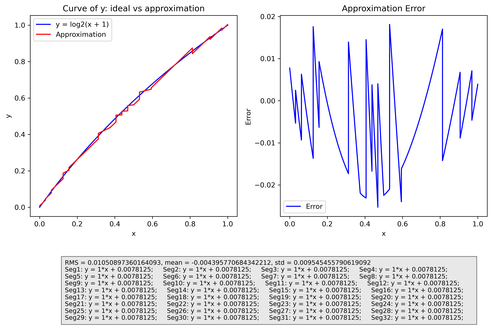

<!-- omit from toc -->
# A LNS-based Square Root Computation
***Made by deLini1612 as a part of ICS project***

---

## Table of Contents
- [Table of Contents](#table-of-contents)
- [Overall](#overall)
  - [Proposed Architecture](#proposed-architecture)
  - [Basic Principle](#basic-principle)
  - [Approximation Method for LNS \<-\> BNS Conversion](#approximation-method-for-lns---bns-conversion)
    - [Conversion Algorithms](#conversion-algorithms)
- [Error Analysis and Proposed Correction Terms](#error-analysis-and-proposed-correction-terms)
  - [Error Expression](#error-expression)
  - [Correction Terms](#correction-terms)
  - [Comparison of Errors with Different Correction Schemes](#comparison-of-errors-with-different-correction-schemes)
- [Hardware Implementation and Results](#hardware-implementation-and-results)
  - [Error Analysis](#error-analysis)
  - [Synthesis Results](#synthesis-results)
- [Future Work](#future-work)

--- 
## Overall
This project implements a square root computation based on the binary logarithm and [Mitchell's approximation](https://ieeexplore.ieee.org/document/5219391), with an additional correction term. It builds upon the paper ["A Unified Hardware Design for Multiplication, Division, and Square Roots Using Binary Logarithms"](https://www.mdpi.com/2073-8994/16/9/1138), correcting the root error expression in the original work and proposing new correction terms.

This repository contains:
- **Jupyter Notebook ([`SquareRoot.ipynb`](SquareRoot.ipynb))**  for analyzing the theoretical and mathematical aspects.
- **Hardware implementation** of the proposed architecture. HDL source code and the testbench for each unit as well as the whole system can be found in [HDL dir](./HDL/).
- **Generated results and figures** stored in the [Figure dir](./Figure).

### Proposed Architecture
The proposed design is a combinational architecture with:
- **2 generics** (or parameters): `IN_WIDTH`(number of bits in input) and `NUM_SEG` (representing the number of most significant fractional bits used for correction --> `2^NUM_SEG` is segments used in the correction)
- **1 input**: Format as an unsigned integer, with size of `IN_WIDTH` bits.
- **1 output**: Format as an unsigned integer, with size of `IN_WIDTH/2` bits.

### Basic Principle
To simplify square root computation (which is complex and costly), we utilize logarithmic properties, reducing the operation to simple shift operations. The process consists of three main steps:
1. **Convert input $X$ to logarithm domain:**
   - $X_{log} = log_2(X)$, represented in fixed-point format.
2. **Compute the square root in log domain:**
   - $Y_{log} = log_2(X)/2$, which is equivalent to shifting left by one bit.
3. **Convert back to the normal domain:**
   - $Y = 2^{Y_{log}}$, followed by rounding to the nearest integer.

### Approximation Method for LNS <-> BNS Conversion
To switch between the **binary number system (BNS)** and the **logarithmic number system (LNS)** efficiently, we use **Mitchell's approximation**: $log_2(x+1) \approx x$ for $x \in [0,1)$.

#### Conversion Algorithms
1. **BNS → LNS:**
   - A positive number $X$ can be expressed as $X = 2^k(1+x)$, where $k$ is an integer ($k \geq 0$) and $x \in [0,1)$.
   - Using Mitchell's approximation: $log_2(X) ≈ k + x$.
2. **LNS → BNS:**
   - Given a real positive number $Y = x + k$, where `k = int(Y)` and `x = fractional(Y)`, we approximate: $2^Y ≈ 2^k (1 + x)$.

The `Mitchell BNS - LNS approx func` in the Jupyter Notebook provides the function for these transformations.

## Error Analysis and Proposed Correction Terms
### Error Expression
Since the approximation introduces errors, we evaluate them using the **relative error** `Es = (R' - R) / R`, where:
  - `R'` is the obtained result from our approximation.
  - `R` is the ideal result.

For input $X = 2^k(1+x)$, we approximate $log_2(X) ≈ k + x$, then the approximation log2 of the result will be $log_2(R') = (k + x)/2$

Depending on `k` and `x` of the input, integer and fractional parts of $log_2(R')$ vary, forming 3 distinct cases:

1. If $k+x < 2 \rightarrow k < 2$: There are only 4 cases for the inputs -> calculate Es of these case.
   
   $\rightarrow X \in \{0, 1, 2, 3\}$ along with $R' \in \{0, 1, 1.5, 1.75\}$ (When input is 0, the output will be handled using an exception block)

   $\rightarrow Es \in \{0, 0, \frac{1.5 - \sqrt{2}}{\sqrt{2}}, \frac{1.75 - \sqrt{3}}{\sqrt{3}}\}$, respectively.
2. If $k+x \ge 2$ and k even (it means frac(k/2) = 0):

    $\rightarrow \text{frac}(log_2(R')) = x/2$, $\lfloor log_2(R') \rfloor = k/2 \rightarrow R'=2^{k/2}(\frac{x}{2} + 1)$

    $\rightarrow Es = \frac{R'}{R} - 1 =\frac{2^{k/2}(\frac{x}{2} + 1)}{2^{k/2}\sqrt{x+1}} - 1 =\frac{x+2}{2\sqrt{x+1}}-1$
3. If $k+x \ge 2$ and k odd (it means frac(k/2) = 0.5):

    $\rightarrow \text{frac}(log_2(R')) = x/2 + 0.5$, $\lfloor log_2(R') \rfloor = (k-1)/2 \rightarrow R'=2^{(k-1)/2}(\frac{x}{2} + 1.5)$

    $\rightarrow Es = \frac{R'}{R} - 1 =\frac{2^{(k-1)/2}(\frac{x}{2} + 1.5)}{2^{k/2}\sqrt{x+1}} - 1 =\frac{x+3}{2\sqrt{2(x+1)}}-1$

These cases are defined in the `New proposed correction terms (For Em and Es)` section of the notebook as `Es2` (for case 2) and `Es3` (for case 3).

We can see that Es >= 0 for every input and min(Es) = 0, max(Es) = $\frac{3}{2\sqrt{2}} - 1 \approx0.060660172$.

### Correction Terms
To mitigate errors, we introduce a correction term $R_{correct} = log_2{(1+Es)}$. 

It is because from $Es = \frac{R'}{R} - 1 \rightarrow R = \frac{R'}{Es+1} \rightarrow log_2(R) = log_2(R')+log_2\frac{1}{1+Es}$. We want to store positive correction term but $log_2\frac{1}{1+Es}$ always < 0 when Es > 0, we cannot store it as correction terms. Therefor, we store $log_2{(1+Es)}$ as correction terms and $R_{out} = R' - R_{correct}$.

We categorize correction terms into two cases:
1. **For `k < 2`**:
   - Since input can only take values `{0,1,2,3}`, we store direct correction terms for these cases.
2. **For `k ≥ 2`**: The error expression only depends on `x` (`k` is just the condition to determine which case Es2 or Es3).
   - The fractional part `[0,1)` is divided into segments.
   - We compute the **average correction term** for each segment using integration (for both Es2 and Es3 expression).

Functions `compute_correction_root` (for the original paper) and `compute_correction_root_new` (for our proposed model) handle these correction term calculations. The value of correction term table is store in ***txt*** files under [CorrTermDir directory](./CorrTermDir/) with the naming convention: `log_{NUM_SEG}s.txt`

### Comparison of Errors with Different Correction Schemes
The **relative error distribution** for different correction schemes is shown in below figure. As can be seen from the figure, the proposed correction terms is more efficient than the correction term in the paper (it is because the correction term of the paper is not considering the error in anti-logarithm conversion).

This project also includes correction schemes for multiplication and division (not displayed here, see detail in [this dir](./Figure/Software_Results/)).

## Hardware Implementation and Results

We evaluated the trade-offs between **accuracy, resource utilization, and correction segment count** through synthesis and error analysis.

### Error Analysis
There are 2 architectures with different output format (integer and fixed-point). A testbench is used to test all architecture and the result will be post-process to analyze the error, as summarized in below table. 

> The detailed figure about error analysis of all architectures are in [Hardware_Results folder](Figure/Hardware_Results).

| **IN WIDTH** | **NUM SEG** | **Output**   | **Input range** | **Max abs(relative error)** | **Mean relative error** | **Std relative error**|
|:------------:|:---------------:|:----------:|:------------:|:------------------:|:------------------:|:------------------:|
| 8 | 2 | Fixed point | [0, 255] | 0.02475 | 0.00438 | 0.00586 |
| 8 | 3 | Fixed point | [0, 255] | 0.01370 | 0.00410 | 0.00386 |
| 8 | 4 | Fixed point | [0, 65535] | 0.01370 | 0.00483 | 0.00320 |
| 16 | 2 | Fixed point | [0, 65535] | 0.01825 | 0.00035 | 0.00440 |
| 16 | 3 | Fixed point | [0, 65535] | 0.01026 | 0.00033 | 0.00320 |
| 16 | 4 | Fixed point | [0, 65535] | 0.00604 | 0.00032 | 0.00233 |
| 32 | 2 | Fixed point | [0, 4194303] | 0.01823 | 0.00034 | 0.00540 |
| 32 | 3 | Fixed point | [0, 4194303] | 0.01025 | 0.00031 | 0.00320 |
| 32 | 4 | Fixed point | [0, 4194303] | 0.00607 | 0.00030 | 0.00232 |
| 8 | 2 | Int | [0, 255] | 0.29289 | -0.00083 | 0.04405 |
| 8 | 3 | Int | [0, 255] | 0.29289 | -0.00127 | 0.04379 |
| 8 | 4 | Int | [0, 65535] | 0.29289 | -0.00023 | 0.04390 |
| 16 | 2 | Int | [0, 65535] | 0.29289 | 0.00034 | 0.00655 |
| 16 | 3 | Int | [0, 65535] | 0.29289 | 0.00031 | 0.00493 |
| 16 | 4 | Int | [0, 65535] | 0.29289 | 0.00030 | 0.00440 |
| 32 | 2 | Int | [0, 4194303] | 0.29289 | 0.00034 | 0.00542 |
| 32 | 3 | Int | [0, 4194303] | 0.29289 | 0.00031 | 0.00324 |
| 32 | 4 | Int | [0, 4194303] | 0.29289 | 0.00030 | 0.00239 |

In integer-output architecture, the maximum relative error is high because when input is 3, because we round the output to integer, the output will be round to 2. This case, the absolute error and the input ratio is very large. Overall, the relative error intend to decrease when the input increase (as in figure below) and number of segment increase will increase the accuracy of the system as well.

Absolute error have the trend to increase as the input increase. Figure below is the Absolute Error vs Input in case `IN_WIDTH` = 32, `NUM_SEG` = 4 and output is integer.

### Synthesis Results

**8 architectures with integer output**, which has varying input bit widths (`IN_WIDTH`) and numbers of correction segments (`NUM_SEG`) are synthesized.

- **Synthesis Tool:** Quartus
- **Target Board:** `5CGXFC7C7F23C8` (Cyclone V Family)
- **Clock Period:** 110 ns (same as the ADE project for comparison)

> The final row of our synthesis table corresponds to the combinational architecture (`a3`) from the [ADE project](https://github.com/deLini1612/Square_root_computing).

| **IN_WIDTH** | **NUM_SEG** | **ALMs**   | **Register** | **Masx Frequency** |
|:------------:|:---------------:|:----------:|:------------:|:------------------:|
|      64      |        8        |    397     |      123     |     31.46 MHz      |
|      32      |        8        |    173     |      56      |     41.03 MHz      | 
|      16      |        8        |    78      |      27      |     56.59 MHz      |
|       8      |        8        |    33      |      12      |     86.84 MHz      |
|      64      |        16       |    423     |      108     |     31.49 MHz      |
|      32      |        16       |    186     |      59      |     42.48 MHz      |
|      16      |        16       |    82      |      26      |     49.33 MHz      |
|       8      |        16       |    36      |      14      |     85.03 MHz      |
|   **_64_**   |    **_None_**   | **_1352_** |   **_111_**  |  **_10.07 MHz_**   |  

## Future Work

One direction for the future work can be the new approximation terms for the logarithm rather than Mitchell's approximation.

I proposed we can divide the range (0,1] into many segment and each segment we will approximate $y = log_2(x)$ by a linear function: ***y = A*x+B**. All coefficient A and B are the power of 2 to reduce the hardware complexity (it means $A, B \in \{2^i | i \in Z\}$). The functions will be choose so that the RMS over (0,1] range is minimized.

> Full code to decide the functions is presented in Jupyter Notebook under `New approx method` section, the figure results for 1, 2, 4, 16, 32, 64 segments in [New_approx dir](Figure/New_Approx).

Below is the proposed approximation functions, along with its error when using 32 segments.

